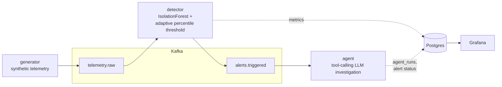

# Sentinel

Real-time predictive monitoring platform: synthetic telemetry → per-host
anomaly detection with an adaptive threshold → an LLM agent that
investigates each alert and proposes a fix. Runs locally with
`docker compose up`.

## Architecture



Postgres is the single system of record (`hosts`, `metrics`, `alerts`,
`agent_runs`); Grafana reads those tables directly. Kafka is just the
streaming backbone between services.

| Service | Role |
|---|---|
| `generator` | Simulates 6 hosts / 4 fake services with diurnal load + injected anomalies. |
| `detector` | Per-host `IsolationForest` scoring + adaptive percentile threshold (not a fixed cutoff) with per-host alert cooldown. |
| `agent` | Multi-turn tool-calling loop (mocked tools: metrics, logs, runbook, deploy history) against GPT-4o or a free deterministic mock. |
| `grafana` | Auto-provisioned dashboard — telemetry, score vs. threshold, alert feed. |

## Key design decisions

- **Dynamic threshold**: `threshold = p95(recent scores)` per host, adapting
  automatically as behavior shifts, with a 60s per-host cooldown after each
  alert — see [`dynamic_threshold.py`](services/detector/app/dynamic_threshold.py).
- **Mock-by-default LLM**: `LLM_PROVIDER=mock` walks the same tool-calling
  code path as real GPT-4o, so the whole pipeline demos for free.
- **Hand-rolled tool loop**, no agent framework — see
  [`tool_loop.py`](services/agent/app/tool_loop.py).
- **Postgres, no ORM**: three tables, mostly-append writes, raw SQL used
  directly by both the write path and Grafana.
- **Alert ownership**: detector inserts the `alerts` row (status `new`); the
  agent only ever updates its status — avoids create/race ambiguity.
- **Early-warning prediction**: alongside the reactive threshold alert, the
  detector fits a trend line over recent (smoothed) anomaly scores and, if
  rising, predicts minutes-to-breach before the threshold is actually
  crossed — see [`trend_forecast.py`](services/detector/app/trend_forecast.py).

## Running locally

```bash
cd sentinel
cp .env.example .env      # defaults work out of the box, LLM_PROVIDER=mock
docker compose up --build -d
```

- `docker compose ps` — confirm `kafka-init` exited 0, rest healthy.
- `docker compose logs -f generator detector agent` — watch it warm up.
- http://localhost:3000 (`admin`/`admin`) — dashboard, refreshes every 5s.
- `./scripts/seed_check.sh` — quick SQL sanity check.

First alerts appear a few minutes in (~120 events/host warm-up). Stop with
`docker compose down` (`-v` to also drop the Postgres volume).

**Real LLM**: set `LLM_PROVIDER=openai` + `OPENAI_API_KEY` for GPT-4o, or
`LLM_PROVIDER=openrouter` + `OPENROUTER_API_KEY` for any [OpenRouter](https://openrouter.ai)
model (`OPENROUTER_MODEL` defaults to `openai/gpt-oss-20b:free` — no cost).
Then `docker compose up -d --build agent`.

## Deploying to AWS

`deploy/aws/` has a minimal Terraform module: one EC2 instance
(`t3.medium` by default — the smallest size that comfortably fits
Kafka+Zookeeper+Postgres+Grafana+3 services), a security group open only on
22 (SSH, restricted to your IP) and 3000 (Grafana), and an Elastic IP.
Kafka/Postgres are bound to `127.0.0.1` in `docker-compose.yml`, so they're
never internet-reachable regardless of the security group.

```bash
cd deploy/aws
terraform init
terraform apply -var="key_name=<your-ec2-keypair>" -var="ssh_cidr=<your-ip>/32"
```

Boots in mock mode with zero secrets (see `user-data.sh.tpl`). SSH in
afterwards to edit `/opt/sentinel/.env` (real LLM key, Grafana password)
and `docker compose up -d`.

**Cost**: not covered by AWS's always-free tier (`t3.medium` needs more RAM
than a `t2/t3.micro`). Running 24/7 is roughly $30–35/month (instance +
EBS); stop the instance when not in use to pay only for storage (~$2/month).

## Repository structure

```
sentinel/
├── docker-compose.yml
├── common/                # shared settings, Kafka/DB helpers, schemas
├── services/{generator,detector,agent}/app/
├── db/init/001_schema.sql
├── kafka/init/            # topic-creation job
├── grafana/                # provisioned datasource + dashboard
└── scripts/seed_check.sh
```

## Configuration

Full list in [`.env.example`](.env.example). Highlights:

| Variable | Default | Meaning |
|---|---|---|
| `GEN_ANOMALY_INJECTION_RATE` | `0.02` | Per-host, per-tick odds of an injected anomaly. |
| `DET_WARMUP_EVENTS` | `120` | Events buffered before first model fit. |
| `DET_THRESHOLD_PERCENTILE` | `95` | Percentile of recent per-host scores used as the alert threshold. |
| `DET_TREND_HORIZON_MINUTES` | `20` | Max lookahead for early-warning breach predictions. |
| `LLM_PROVIDER` | `mock` | `mock`, `openai`, or `openrouter`. |
| `AGENT_MAX_TOOL_TURNS` | `6` | Turns before forced diagnosis. |

## Limitations

Local demo only — no auth/TLS, single-broker Kafka, no Kubernetes.
`search_logs` / `get_deploy_history` are synthetic fixtures. Detector model
state is in-memory (no persistence). No schema registry.
